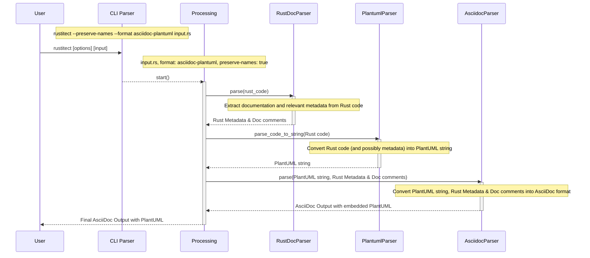

# Rustitect

A rust-to-arc42 Documentation Generator.

Rustitect is an application designed to generate arc42 class specifications in Asciidoc format from Rust code. It leverages the capabilities of PlantUML to produce clear, concise diagrams.

---
## Idea
Within the [arc42](https://docs.arc42.org/home/) architectural documentation template, it's beneficial to employ the [C4 Model](https://c4model.com/) for elucidating the system's context and its building block view. 
In the C4 Model, the fourth level (L4) pertains to class diagrams. 
**Rustitect** is designed with the idea of automating this L4 representation.

By leveraging Rustitect, developers can automatically generate class diagrams directly from their Rust codebase. 
When developers commit to writing comprehensive and clear documentation within their code, the descriptions for structs, and other entities, can be seamlessly extracted and integrated into the generated diagrams. 
This not only promotes a high degree of alignment between code and documentation but also encourages good documentation practices from the onset.

## Overview

**Rustitect** is a tool designed to generate arc42 class specifications in Asciidoc format from Rust code, incorporating PlantUML diagrams for enhanced visualization. It offers developers a streamlined way to produce detailed documentation without manual effort, right from the codebase.

**Key Features:**
- **Rust Documentation Parsing**: Using the `RustDocParser`, Rustitect extracts documentation and relevant metadata directly from Rust source code.

- **PlantUML String Generation**: The `PlantumlParser` helps transform Rust structures into a PlantUML string representation, paving the way for visual diagrams.

- **Asciidoc Conversion**: `AsciidocParser` processes the PlantUML string, Rust documentation comments, and metadata, converting it all into an integrated AsciiDoc format. It allows for an embedding of the PlantUML diagrams within the AsciiDoc output, offering a richer documentation experience.

- **CLI Support**: Rustitect's Command-Line Interface (CLI) is intuitive, accepting various arguments to customize the output format and other preferences. Whether you want to parse from a file or standard input, Rustitect has got you covered.

By taking a Rust file as input, Rustitect crafts a comprehensive arc42 documentation structure in AsciiDoc, seamlessly integrating PlantUML diagrams. Developers can leverage this to maintain up-to-date documentation with minimal manual intervention, ensuring that the docs always mirror the current code state.

## Flow Diagram



## Building the Application

Before you can use Rustitect, you'll need to build it from source. Here are the steps to do that:

### Prerequisites

Ensure you have the following installed:

- [Rust](https://www.rust-lang.org/tools/install)
- Cargo (comes with Rust)
- [Pandoc](https://pandoc.org/installing.html)

### Steps

1. **Clone the Repository**
2. **Build the Application**

   Using Cargo, the Rust package manager:

    ```bash
    cargo build --release
    ```

   The `--release` flag will build the application in release mode, which will optimize it for performance. The built binaries will be located in the `target/release` directory.

3. **(Optional) Add to Path**

   If you wish to run the application from any directory, consider moving the binary to a directory in your system's PATH or add the `target/release` directory to your PATH.

---

## Usage

### Basic Usage

#### See help
```bash
rustitect --help
```

#### Reading from a file and writing to stdout:
```bash
$ rustitect path/to/rust_file.rs
```

#### Reading from stdin and writing to stdout:
```bash
$ cat path/to/rust_file.rs | rustitect
```

### Advanced Usage
#### Preserve input file name to output file name (rust_file.adoc):
```bash
$ rustitect --preserve-names path/to/rust_file.rs
```

#### Specify output format:
```bash
$ rustitect --format=markdown path/to/rust_file.rs
```

#### Read from stdin, write to a specific file:
```bash
$ cat path/to/rust_file.rs | rustitect -o output_file.adoc
```

#### Separate asciidoc and plantuml files:
```bash
rustitect --preserve-names --format asciidoc-plantuml path/to/rust_file.rs
```


## Development

To contribute to Rustitect, please fork the repository and submit a pull request.

---
## License

Rustitect is licensed under the MIT License. See [LICENSE](./LICENSE) for details.

### Third party licenses (NOTICE)
Thanks to the great work of the following projects and their licenses, Rustitect is able to provide its functionality (see [NOTICE](./NOTICE) for details):
